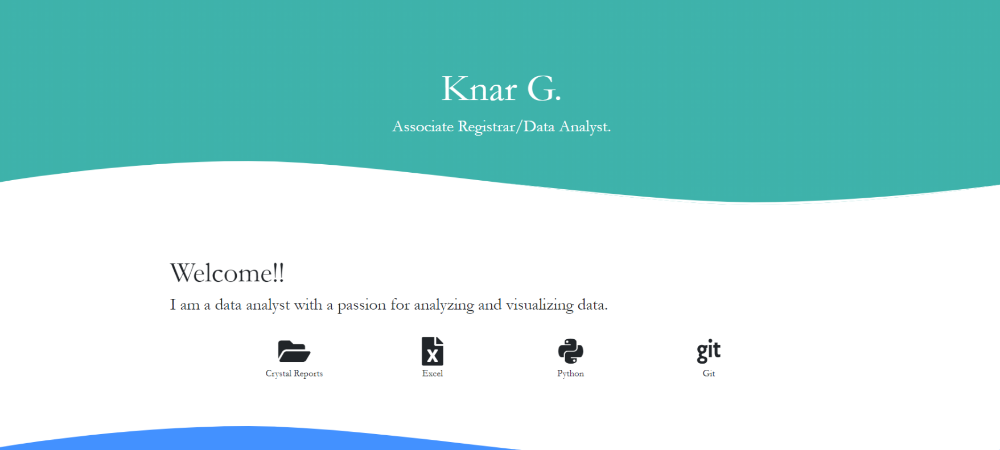
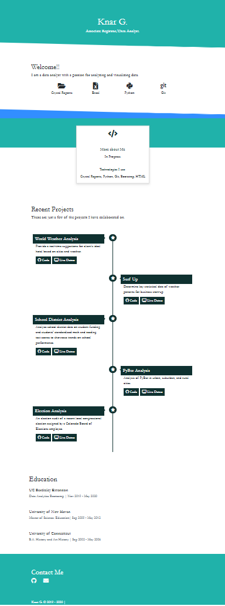

# Mission-to-Mars
Python, MongoDB, VS Code, Jupyter Notebook, Flask

# Project Overview/Challenge
- Use BeautifulSoup and Splinter to automate a web browser and scrape Mars' news data, images and facts. 
- Use MongoDB database to store data from the web scrape. 
- Use the web application and Flask to display the data from web scrape

# Resources
- Data Source: https://mars.nasa.gov, https://www.jpl.nasa.gov/spaceimages/?search=&category=Mars, https://astrogeology.usgs.gov/search/results?q=hemisphere+enhanced&k1=target&v1=Mars, http://space-facts.com/mars
- Software: Jupyter Notebook, Visual Studio Code, 1.40.2. Flask, MongoDB, BeautifulSoup, Splinter

# Summary
- Practice
	- Used Jupiter Notebook 
		- pull data from https://mars.nasa.gov the latest Mars' news to populate the Mars web app. 
		- pull recent featured image of Mars from https://www.jpl.nasa.gov/spaceimages/?search=&category=Mars to display on the Mars web app. 
		- pull Mars data from http://space-facts.com/mars to display on the Mars web app.
	- After pulling all the necessary data for the Web app, refactored the code to include function to run with Flask app.py.
	- Created Flask app to scrape data store in the MongoDB database and display the data on the web app. 
	- Created HTML template.

- Challenge
	- Used Jupiter Notebook
		- pull the high-resolution Mars' hemisphere images from https://astrogeology.usgs.gov/search/results?q=hemisphere+enhanced&k1=target&v1=Mars, http://space-facts.com/mars. 
	- Refactored the code to create fuctions to scrape Mars' hemisphere images and hemisphere titles to run with Flask app.
	- Run Flask app.py to update the data in MongoDB database.
	- Updated the web application and Flask to dicplay Mars' hemisphere images with title. 

- Portfolio
	- Created personal Portfolio with personal information and samples of projects. 

	

